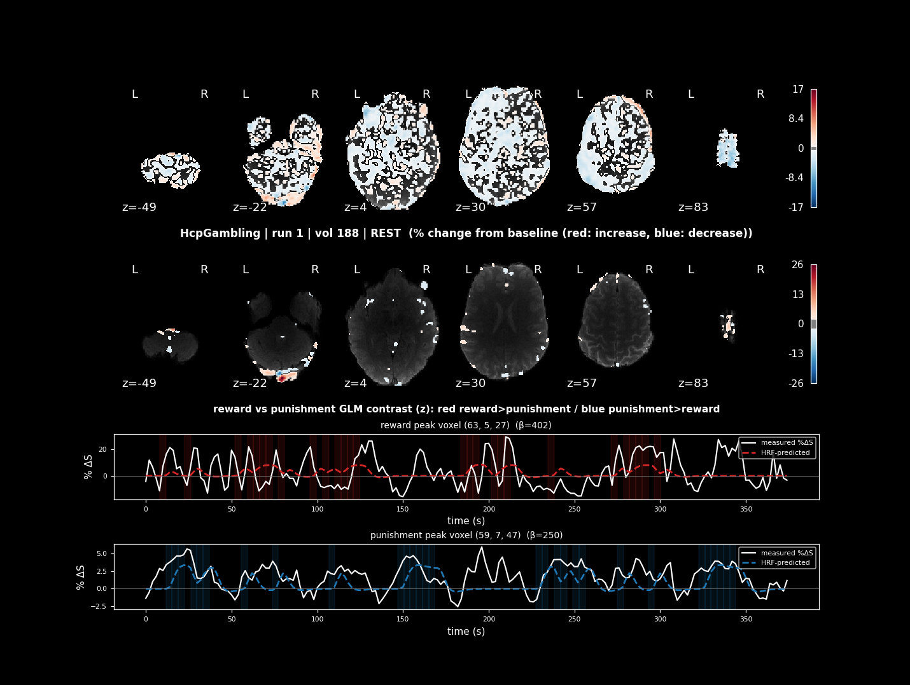

# Real-Time fMRI Task Activation (registration-free)

A generic RT-Cloud project that shows **task activation in real time** for any
block/event fMRI design, with **no anatomical registration**. The brain mask
and ROIs are derived from the functional data itself, and the realtime
activation maps are plotted with **nilearn**. The design is read from a BIDS
`events.tsv`, so it adapts to any task: rest is implicit, the conditions of
interest are set by `glmCondA`/`glmCondB`, and every other `trial_type`
becomes a GLM covariate. Two ready-made configs ship with the project — the
ds000244 "HcpMotor" task (LEFT vs RIGHT hand) and "HcpGambling" (reward vs
punishment) — used throughout this doc as worked examples.

**Setup:** see **[INSTALLATION.md](INSTALLATION.md)** for one-time setup
(Docker image, host-side Python deps, prefetching demo data, and installing
`dicom_bridge.py` as a background service).
**Testing:** see **[TESTING.md](TESTING.md)** to verify each component works
in isolation before connecting to a real scanner.

This file focuses on the **main way to run the project — against live
scanner data — and what the outputs actually look like.**

## How it works

The analysis is task-agnostic — it reads the design straight from the events
file and classifies `trial_type`s automatically:

- **Rest** is implicit: any period with no event (or an event whose name
  looks like rest/fixation/baseline/iti/blank…) is the GLM baseline — no rest
  regressor is added. Override detection with `restTypes` in the toml.
- **Conditions of interest** are whatever you put in `glmCondA` / `glmCondB`.
- **Every other `trial_type`** in the events file is added as its own GLM
  covariate regressor, so its variance is modeled out of the contrast.

To point it at a different task, set `taskName` + `eventsFile` and the
conditions. `conf/taskActivation_gambling.toml` is a full worked example
(`task-HcpGambling`, `reward` vs `punishment`, with `neutral` automatically
becoming a covariate).

It reads data three ways, selected by `dataSource` in the toml:

- **`dicom`** — streams DICOMs from a real (or mock) scanner via `dicomDir/`.
  This is the live-scanning path; see below.
- **`nifti`** — downloads one BOLD run from OpenNeuro's public S3 mirror
  (once, then cached) and replays its volumes. Used by the two demo configs
  and by [TESTING.md](TESTING.md) — not for live scanning.
- **`openneuro`** — rt-cloud's `initOpenNeuroStream`, only for datasets with a
  BIDS `run` entity (neither demo dataset has one, so they use `nifti`
  instead).

## Quick start: direct testing (no web interface)

This mirrors rt-cloud's ["Testing Your Project
Directly"](https://github.com/brainiak/rt-cloud) pattern: it runs
`taskActivation.py` straight inside the container for rapid iteration,
without spinning up the projectInterface/projectServer, certs, or a browser.
It's how the demo configs (and [TESTING.md](TESTING.md)) are meant to be run;
for a real scanner, see [Running with live scanner data](#running-with-live-scanner-data)
below.

```bash
PROJ_NAME=taskActivation
PROJ_DIR=/full/path/to/taskActivation
DICOM_DIR=/full/path/to/dicomDir      # only needed for dataSource = "dicom"
OUT_DIR=/full/path/to/outDir          # where current.png / motion.png / the GIF land

docker run -it --rm \
  -v $PROJ_DIR:/rt-cloud/projects/$PROJ_NAME \
  -v $DICOM_DIR:/rt-cloud/projects/$PROJ_NAME/dicomDir \
  -v $OUT_DIR:/rt-cloud/outDir \
  brainiak/rtcloud:latest python projects/$PROJ_NAME/$PROJ_NAME.py
```

`PROJ_DIR` must point at *this* folder (`taskActivation/`, containing
`taskActivation.py`), since `PROJ_NAME` is used both as the mount point and as
the script filename. With the default `dataSource = "nifti"` config you don't
need `DICOM_DIR` at all — drop that `-v` line.

On startup `ClientInterface()` can't reach a project server inside this
single-container run, and will ask:
`Unable to connect to projectServer, continue using localfiles? (y/n):` —
answer **y** (the `-it` flag keeps the container interactive so you can type
it). This runs `webInterface`/`subjInterface`/`dataInterface` locally in the
same process instead of over RPC.

`OUT_DIR` is mounted by default here specifically so you can actually see the
outputs: without it, `outDir/live/current.png`, `motion.png`, the end-of-run
GIF, etc. are written *inside* the `--rm` container and vanish the moment it
exits — you'd never see them on the host at all. With it mounted, they appear
in `$OUT_DIR/live` as the run progresses (see
[Data outputs to expect](#data-outputs-to-expect)).

**Full project interface (browser dashboard):** if you'd rather use rt-cloud's
web UI (login `test`/`test`, a **Data Plots** tab for the live ROI trace), run
`scripts/run-projectInterface.sh` instead — see the
[run-in-docker docs](https://github.com/brainiak/rt-cloud/blob/master/docs/run-in-docker.md).
The brain-image plot still isn't shown in the browser either way; you always
need `realtime_display.py` (below) for that.

## Running with live scanner data

Point `dataSource = "dicom"` at a **real** scanner's DICOM output and this
project needs two things the demo (`nifti`) configs don't have to deal with:

**1. rt-cloud can't match your scanner's real filenames.** rt-cloud's DICOM
watcher builds one exact, predictable filename per volume with plain
`str.format()` — it has no wildcard/glob support. If your site's real-time
export appends an unpredictable SOPInstanceUID (a common convention, e.g.
`002_000003_000001_1.3.12.2.1107....dcm`), no `dicomNamePattern` can match it.
`dicom_bridge.py` solves this: it watches the real drop folder (`--source`),
reads each file's actual `SeriesNumber`/`InstanceNumber` from its DICOM
header (not its filename — conventions vary by site), and copies it into a
destination folder (`--dest`) renamed to match `dicomNamePattern` exactly. It
only renames — dcm2niix already handles Enhanced multi-frame DICOM natively,
so no pixel data is touched. It also has to patch one metadata field:
rt-cloud's own metadata reader only looks at top-level DICOM tags, so a
nested `RepetitionTime` (where Enhanced multi-frame DICOM stores it) has to
be promoted to the top level, or every volume fails with
`MissingMetadataError`.

**`--source` and `--dest` are two different folders, and both matter:**
`--source` is the real scanner's raw export location (anywhere readable —
often a network share). `--dest` is **the same `$DICOM_DIR` you bind-mounted
into the container** in the [direct-testing command](#quick-start-direct-testing-no-web-interface)
above (`-v $DICOM_DIR:/rt-cloud/projects/taskActivation/dicomDir`) — that's
how the bridged files actually reach the container. `--dest` isn't required
(it falls back to this project's own `dicomDir/` folder on disk if omitted),
but for a real scan you should pass it explicitly so it's unambiguous which
folder is being fed into the container:

By default `RUN` in the output filename is each file's own real
`SeriesNumber` — not a fixed value — so bridging everything in the drop
folder is collision-safe (an SBRef series and a bold series land in
`$DICOM_DIR` under distinct `RUN` labels, never overwriting each other):

```bash
DICOM_DIR=/full/path/to/dicomDir   # same folder as -v $DICOM_DIR:.../dicomDir in the docker command

# bridge every series found, each kept separate by its own SeriesNumber:
python dicom_bridge.py --config conf/taskActivation.toml \
  --source /path/to/real/scanner/drop/folder --dest $DICOM_DIR

# one-shot backfill (bridge what's there now, then exit):
python dicom_bridge.py --config conf/taskActivation.toml \
  --source /path/to/real/scanner/drop/folder --dest $DICOM_DIR --once
```

Pass `--series` to bridge only one run, and/or `--run` to relabel it to a
fixed value instead of using the real `SeriesNumber` (useful when the toml's
`runNum` needs to stay the same across sessions whose real series numbers
change — `--run` requires `--series`, since forcing one `RUN` value while
bridging multiple series would collide):

```bash
# only series 3, relabeled as RUN 1 (matches a toml with runNum = [1]):
python dicom_bridge.py --config conf/taskActivation.toml \
  --source /path/to/real/scanner/drop/folder --dest $DICOM_DIR --series 3 --run 1
```

Run this in a second host terminal (it has no `rtCommon` dependency, so it
doesn't run inside the container) — or install it as a background service so
you don't have to; see [INSTALLATION.md](INSTALLATION.md#4-setting-up-dicom_bridgepy-as-a-background-service-systemd)
(the systemd unit example there also shows `--source`/`--dest` set explicitly).

> Real scanner files carry real `PatientName`/`PatientID`/etc. until
> rt-cloud's own `anonymize=True` (already set in `taskActivation.py`'s
> `initDicomBidsStream` call) strips them on read — same as a real scanner's
> raw feed always has. `dicom_bridge.py` doesn't change that; it's expected,
> not a new exposure.

**2. Don't hand-copy the protocol's TR into the toml.** Set `demoStep =
"auto"` (instead of a number) and, in `dicom` mode, `taskActivation.py` will
wait for the first real DICOM to appear in `dicomDir/` and read its actual
`RepetitionTime` before building the GLM design — rather than requiring you
to find and hardcode it. It waits up to `demoStepAutoTimeout` seconds
(default 30; set that key in the toml to change it) and raises a clear error
if nothing arrives in time, so start the scanner / `dicom_bridge.py` /
`mock_scanner.py` first. A numeric `demoStep` always overrides
auto-inference and behaves exactly as before.

**3. Don't let a normal startup gap crash the run.** Each volume fetch waits
up to `dicomTimeout` seconds (default 30) for its DICOM to appear before
raising — rtCommon's own default is only 5s, which is routinely too short
for the real gap before a scan starts (or an occasional slow volume
mid-scan). If nothing arrives within `dicomTimeout`, you get a clear
`RuntimeError` telling you to check that the scanner / `dicom_bridge.py` /
`mock_scanner.py` is actually running and pointed at this `dicomDir` — not a
raw rtCommon traceback. Raise `dicomTimeout` further if your site's startup
delay routinely runs longer.

**Other subjects/runs/tasks:** point `taskName` + `eventsFile` at your own
design (see [How it works](#how-it-works)), and set `dicomNamePattern` +
`runNum` to match what `dicom_bridge.py` / your scanner actually writes.

## Data outputs to expect

The nilearn brain plot is not automatic — nothing renders it for you:

| Output | Where it shows |
|---|---|
| ROI mean % signal change from baseline, one value per volume | rt-cloud web interface **Data Plots** tab (`webInterface.plotDataPoint` — numbers only) |
| nilearn % -change activation plot (ortho cut at the ROI / active peak) | written to `outDir/live/current.png` every volume |
| Full interactive ortho + ROI %-change timecourse | the `realtime_display.py` window, run manually against `outDir/live` |
| Head motion (6 rigid-body params + framewise displacement) | `outDir/live/motion.tsv` / `motion.png` every volume; `motion_display.py` for a live window |
| Replay of the whole run's activation maps | `outDir/live/activation_run<N>.gif`, written once at the end of the run |

The **Data Plots** tab can only render numeric line plots, so the brain image
cannot go there. To see the brain plot, run `realtime_display.py` (or open
`current.png` in any image viewer) on a machine that can see the
`outDir/live/` folder:

```bash
python realtime_display.py /path/to/rt-cloud/outDir/live
```

### The live figure

- **Top row** — the per-frame % difference from baseline as a single-row
  axial mosaic, updated every volume and labeled with the current condition
  (e.g. `left hand`, `REST`, `tongue`). Slice positions: set `zCuts` in the
  toml to a fixed list of z-coordinates in mm, or leave it empty (`[]`) to
  auto-pick `nSlices` levels (default 6).
- **Second row** — a separate axial mosaic of a GLM map. An HRF-convolved
  design matrix (one regressor per effector + polynomial drift + intercept)
  is re-fit by OLS on every volume seen so far as data streams in. `glmCondA`
  / `glmCondB` choose the contrast; leave `glmCondB = ""` to plot the condA
  β-weight alone. `glmZscore` z-scores the map across voxels; `driftOrder`
  sets the drift terms.
- **Bottom rows** — one per condition (condA, condB): at that condition's
  peak-beta voxel, the measured % signal change timecourse plotted against
  the HRF-predicted signal from the fitted GLM, with the condition's stimulus
  blocks shaded. These update live too, starting as soon as the incremental
  GLM has enough volumes to be estimable (not just once at the end) — so
  `current.png` gains these rows partway through the run and keeps refitting
  them every frame after that.

### Replaying a whole run (`activation_run<N>.gif`)

At the end of the run, every frame that was ever written to `current.png`
(one saved bundle per live update) gets re-rendered and assembled into an
animated GIF at `outDir/live/activation_run<N>.gif` — a single, standalone
file you can reopen and replay anytime afterward, without rerunning the
analysis or needing rt-cloud running at all. Controlled by two toml keys:
`saveGif = true` (set `false` to skip it entirely) and `gifFps` (playback
speed; default 8 frames/sec). Building it takes a little while for a long run
(nilearn re-renders every saved frame), so it happens once, after the last
volume, and won't interfere with the live 'while it's running' outputs above.

### Sample output — HcpMotor

Full run, `dataSource = "nifti"`, default `conf/taskActivation.toml` (LEFT vs
RIGHT hand). LEFT hand drives the right motor cortex; RIGHT hand drives the
left motor cortex — the two peak-voxel rows at the bottom show that
lateralized, HRF-shaped response recovered live, volume by volume:


### Sample output — HcpGambling

Full run, `dataSource = "nifti"`, `conf/taskActivation_gambling.toml`
(reward vs punishment, `neutral` regressed out as a covariate):



## Project structure

```
taskActivation/
├── README.md                 # this file — running + outputs
├── INSTALLATION.md           # one-time setup
├── TESTING.md                # verifying each component
├── taskActivation.py         # main RT-Cloud analysis (registration-free, task-agnostic)
├── rt_analysis.py            # shared helpers: design-from-events, masks, nilearn plots
├── realtime_display.py       # standalone nilearn/matplotlib viewer (no PsychoPy); run manually
├── motion_display.py         # standalone head-motion window (also writes motion.png); run manually
├── mock_scanner.py           # simulate a scanner: stream Enhanced multi-frame DICOMs to dicomDir/
├── dicom_bridge.py           # bridge a real scanner's raw filenames into rt-cloud's expected pattern
├── templates/                # anonymized Enhanced multi-frame DICOM header for mock_scanner
├── docs/images/               # sample current.png outputs referenced above
├── test_pipeline.py          # offline end-to-end test on the REAL HcpMotor timing
├── test_generalize.py        # generalization test on HcpGambling (reward/punishment)
├── test_mock_scanner.py      # tests the mock DICOM scanner (frame pack/unpack + recovery)
├── make_design.py            # (optional) write static design files for inspection
├── download_data.sh          # prefetch an OpenNeuro demo BOLD run
├── conf/
│   ├── taskActivation.toml          # HcpMotor demo config (data source, timing, display settings)
│   └── taskActivation_gambling.toml # HcpGambling demo config
├── study_design/
│   ├── HcpMotor_acq-ap_events.tsv    # real ds000244 HcpMotor events (drives the design)
│   └── HcpGambling_acq-ap_events.tsv # real ds000244 HcpGambling events
└── dicomDir/                  # scanner DICOMs (dicom mode only)
```

## Per-volume pipeline (registration-free)

1. DICOM → Nifti via the BIDS incremental
2. Motion correction to the functional reference (`mcflirt`) — realignment only
3. 5 mm FWHM Gaussian smoothing (`fslmaths`)
4. Brain mask from the functional reference (intensity threshold, or BET on
   the sbref) — no atlas/warp
5. Accumulate the volume into the running per-condition averages
6. Update ROI traces, the % signal change map, and the incremental GLM map

## Notes & caveats

- The per-frame activation map is a running % signal change from baseline;
  the GLM map (second row) is a proper incremental OLS fit — not the same
  contrast, by design (the first is fast/transparent for live viewing, the
  second is the statistically real one).
- The functional brain mask degrades gracefully: `bet` → nilearn
  `compute_epi_mask` → intensity threshold. Tune `maskMethod`/`maskFrac`/
  `maskFraction`/`maskPercentile` for your EPI if coverage looks off (printed
  every run, and saved to `outDir/live/brain_mask.nii.gz`).
- The base `brainiak/rtcloud` image has FSL (`mcflirt`/`fslmaths`) and
  numpy/nibabel; `nilearn` installs itself on first run if missing (a
  matplotlib montage is used instead if that install fails).
