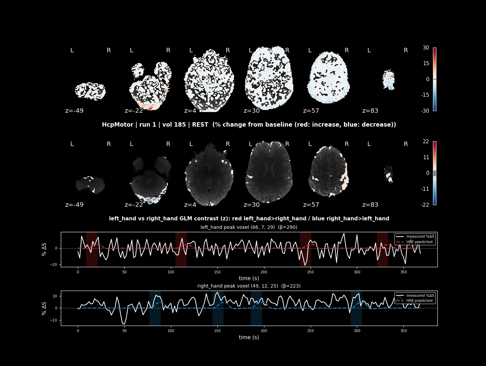

# Tutorial: offline validation against real HCP task data

This folder validates the analysis in
[`../utils/rt_analysis.py`](../utils/rt_analysis.py) — the same code
`../taskActivation.py` runs live against a scanner — without needing a
scanner, Docker, or rt-cloud at all. It's useful for two things:

1. **Proving the pipeline is correct** against known ground truth: real event
   timing from OpenNeuro ds000244, with synthetic (but HRF-realistic)
   activation injected into anatomically correct regions, so each check has a
   known right answer (e.g. "LEFT hand block → activation localizes to the
   RIGHT motor cortex"). `test_pipeline.py` / `test_generalize.py` do this —
   fast, no download, but the *imaging data itself* is fake.
2. **Showing what the live output actually looks like** on **real** brain
   data, before you have scanner access — `replay_real_data.py` downloads an
   actual ds000244 BOLD run and pushes it through the exact same
   preprocessing (mcflirt/fslmaths), masking, GLM, and plotting code
   `taskActivation.py` runs live. The sample images below were produced this
   way.

`../taskActivation.py` itself only streams DICOMs from a real (or mock)
scanner — see the main [README.md](../README.md) and
[TESTING.md](../TESTING.md) for that. Nothing here is needed to run the live
pipeline; this folder is purely for offline validation/demonstration.

## Running the tests

```bash
cd taskActivation/tutorial
python test_pipeline.py       # HcpMotor: synthetic data, real event timing, no download
python test_generalize.py     # HcpGambling: proves the design generalizes to a 3-condition task
```

Both are self-contained (numpy/nibabel/scipy — no download, no Docker) and
print PASS/FAIL per check, exiting 0 only if everything passed. See
[TESTING.md](../TESTING.md#1-tutorialtest_pipelinepy--offline-no-download-no-docker)
for what each check verifies.

## Replaying real data (`replay_real_data.py`)

```bash
cd taskActivation/tutorial
python replay_real_data.py                    # HcpMotor (default)
python replay_real_data.py --task HcpGambling
```

Unlike the two tests above, this downloads (once, then cached under
`openneuro_cache/`, like `download_data.sh`) and processes an **actual**
ds000244 BOLD run — real motion correction, real smoothing, a real brain
mask, a real incremental GLM — so `_real_data_live/current.png` shows real
recovered activation, not synthetic. It's the script that generated the
sample images below, and reusable any time you want a fresh one.

Needs, beyond `test_pipeline.py`'s requirements:
- **FSL** (`mcflirt`/`fslmaths`) on `PATH` — the same tools
  `taskActivation.py` calls, normally already present in the
  `brainiak/rtcloud` image. Running this outside that container (e.g. a bare
  local FSL install) also needs `FSLOUTPUTTYPE=NIFTI_GZ` set (and usually
  `FSLDIR`) — the Docker image sets these for you already, but a local
  install typically doesn't source them automatically:
  ```bash
  export FSLDIR=/path/to/fsl
  export FSLOUTPUTTYPE=NIFTI_GZ
  export PATH="$FSLDIR/share/fsl/bin:$PATH"
  ```
  Without this, `mcflirt` fails silently (no output file) and you'll see a
  `FileNotFoundError` on `temp_sm.nii.gz` a few lines down from an `ERROR::
  Environment variable FSLOUTPUTTYPE is not set!` message.
- **awscli** + network access for the first download (~600 MB; instant after
  that) — see [INSTALLATION.md](../INSTALLATION.md).

Output goes to `tutorial/_real_data_live/` by default (`--out-dir` to
change it); `--task HcpGambling` uses the same reward/punishment/neutral
contrast as `test_generalize.py`. `--save-gif` also builds
`activation_run1.gif` at the end, same as the live pipeline.

## Files here

- `test_pipeline.py` — offline end-to-end test on the real HcpMotor event
  timing (synthetic imaging data, no download needed).
- `test_generalize.py` — generalization test on HcpGambling (reward vs
  punishment vs the `neutral` covariate).
- `replay_real_data.py` — runs the real preprocessing/masking/GLM pipeline
  against an actual downloaded ds000244 BOLD run (see above).
- `hcp_replay.py` — OpenNeuro-download + local-NIfTI-replay helpers
  (`ensure_openneuro_bold`, `NiftiReplaySource`), used by `replay_real_data.py`
  and `test_pipeline.py`. Only used by this folder — the live pipeline
  streams DICOMs and has no use for them.
- `download_data.sh` — prefetch a real BOLD run from OpenNeuro's public S3
  mirror into `openneuro_cache/` ahead of time (optional — `replay_real_data.py`
  downloads it itself on first run either way).
- `conf/taskActivation_gambling.toml` — reference config documenting the
  GLM/task settings (`glmCondA`/`glmCondB`, `eventsFile`) used to produce the
  HcpGambling sample image below via a NIfTI replay. Kept for reference only
  — `taskActivation.py` no longer has a NIfTI-replay data source, so this
  file isn't consumed by any script.
- `study_design/HcpGambling_acq-ap_events.tsv` — real ds000244 HcpGambling
  events (HcpMotor's events.tsv is used by both the live pipeline and
  `test_pipeline.py`, so it stays in `../study_design/`).

## Sample output

Both were produced by replaying real ds000244 BOLD data (via `hcp_replay.py`)
through this same analysis pipeline — this is what `outDir/live/current.png`
looks like from a real run.

**HcpMotor** (LEFT vs RIGHT hand): LEFT hand drives the right motor cortex;
RIGHT hand drives the left motor cortex — the two peak-voxel rows at the
bottom show that lateralized, HRF-shaped response recovered live, volume by
volume:



**HcpGambling** (reward vs punishment, `neutral` regressed out as a
covariate):


